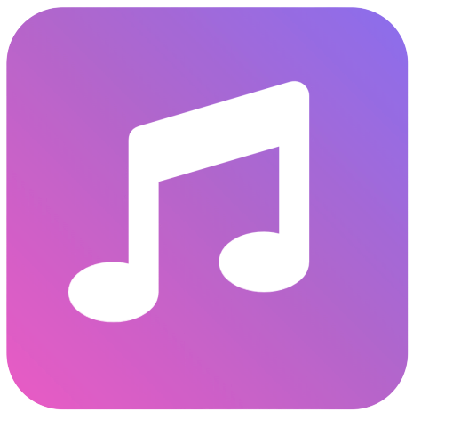

  

  <h3 align="center">Apple Music Activity</h3>

  

     Music Activity is an application that takes your Apple Music data provided by Apple and displays reports of your listening history. Built using Charts.js, Bootstrap, etc.
  

## Status

## View Project
https://richardtaylordawson.github.io/apple-music-activity/
